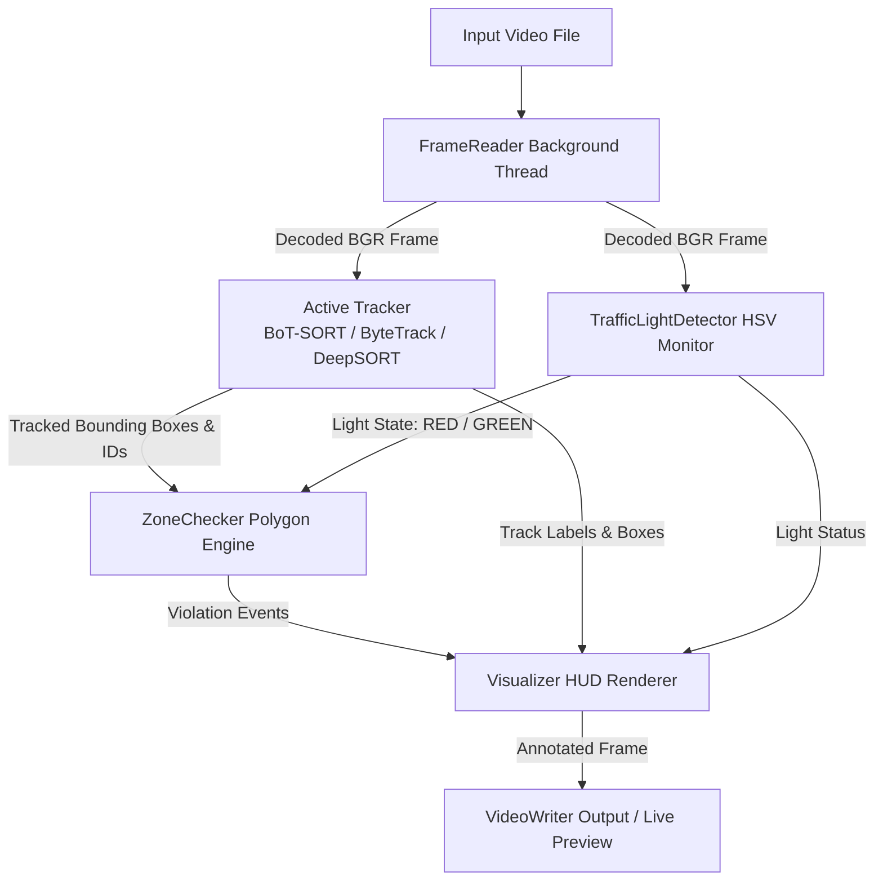

# Vehicle Detection, Tracking, and Traffic Violation Module

An end-to-end, high-performance Computer Vision system designed for real-time vehicle detection, multi-object tracking, traffic light state classification, and automated red-light violation detection in complex traffic video feeds.

Supports multiple tracking engines:
- **BoT-SORT**: Camera motion compensation + high-precision tracking.
- **ByteTrack**: Lightweight, ultra-fast low-confidence association.
- **DeepSORT**: Appearance-based ReID feature embedding and Kalman filter tracking.

---

## 🌟 Key Features

- 🏎️ **Multi-Class Vehicle Detection & Tracking**: Detects and tracks 5 distinct vehicle categories (**Bicycle, Car, Motorcycle, Bus, Truck**) simultaneously using COCO-trained YOLO models.
- 🔀 **Multi-Tracker Architecture**: Switch seamlessly between **BoT-SORT**, **ByteTrack**, and **DeepSORT** by updating a single configuration setting.
- 🔴 **Automated Traffic Light Detection**: Real-time traffic signal classification using HSV color space sampling with sliding-kernel peak response and temporal majority voting.
- 🚨 **Red-Light Violation Detection**: Spatial polygon tracking that continuously monitors vehicle trajectories from approach lanes into intersection regions during red light signals.
- ⚡ **Optimized Pipeline**: Asynchronous multi-threaded `FrameReader` decouples CPU video decoding from GPU inference, with FP16 tensor acceleration.
- 🛠️ **Interactive Zone Drawing GUI**: Built-in OpenCV GUI (`ZoneDrawer`) to interactively map lane boundaries, intersection polygons, and traffic light coordinates directly on video frames.
- 📊 **Headless & Cloud-Ready**: Configurable for headless Linux GPU instances (e.g. AWS, ThunderCompute) or local live visual preview HUD.

---

## 📁 Repository Structure & Modules

```text
VehicleDetectionAndTrackingModule/
├── trackers/                     # Modular tracking engines
│   ├── __init__.py               # Tracker factory `create_tracker(config)` & registry
│   ├── base_tracker.py           # Abstract BaseTracker (interface & common logic)
│   ├── botsort/
│   │   ├── __init__.py
│   │   └── botsort_tracker.py    # Ultralytics YOLO + BoT-SORT
│   ├── bytetrack/
│   │   ├── __init__.py
│   │   └── bytetrack_tracker.py  # Ultralytics YOLO + ByteTrack
│   └── deepsort/
│       ├── __init__.py
│       └── deepsort_tracker.py   # YOLO detector + DeepSORT (deep-sort-realtime)
├── config.py                     # Central configuration & tracker selector
├── vehicle_model.py              # Backward-compatible adapter delegating to trackers/
├── main.py                       # Pipeline orchestrator and FrameReader loop
├── traffic_light_detector.py     # HSV-based traffic light state monitor
├── zone_checker.py               # Point-in-polygon trajectory & violation logic
├── zone_drawer.py                # Interactive OpenCV zone mapping utility
├── visualizer.py                 # Frame HUD renderer, annotations, & statistics overlay
├── setup_cloud.sh                # Environment installer for cloud GPU instances
├── requirements.txt              # Unified Python dependency requirements
├── zones.json                    # Polygon coordinates for lanes, intersections, & lights
├── test_1.mp4                    # Sample input traffic video 1
└── test_2.mp4                    # Sample input traffic video 2
```

---

## ⚙️ Architecture & Pipeline Flow



---

## 🛠️ Installation & Setup

### Prerequisites
- Linux OS (Ubuntu 20.04+ recommended)
- Python 3.9+
- NVIDIA GPU with CUDA support (or CPU mode for local testing)

### Quick Setup

1. **Automated Setup (Cloud GPU / Linux)**:
   ```bash
   bash setup_cloud.sh
   ```

2. **Manual Setup**:
   ```bash
   # System packages
   sudo apt-get update && sudo apt-get install -y ffmpeg libgl1

   # Python dependencies
   pip install -r requirements.txt

   # Pre-download YOLO weights
   python -c "from ultralytics import YOLO; YOLO('yolo26l.pt'); YOLO('yolov8l.pt')"
   ```

---

## 🚀 How to Switch Models & Trackers

In **[config.py](file:///home/trung/Projects/VehicleDetectionAndTrackingModule/config.py)**, set `TRACKER_TYPE` to your desired tracker:

```python
# Select active tracker: 'botsort', 'bytetrack', or 'deepsort'
TRACKER_TYPE = 'botsort'
```

### Tracker Configurations

- **BoT-SORT**:
  ```python
  BOTSORT_CONFIG = {
      'tracker_yaml': 'botsort.yaml',
      'track_thresh': 0.35,
      'match_thresh': 0.6,
      'track_buffer': 60,
  }
  ```
- **ByteTrack**:
  ```python
  BYTETRACK_CONFIG = {
      'tracker_yaml': 'bytetrack.yaml',
      'track_thresh': 0.35,
      'match_thresh': 0.6,
      'track_buffer': 60,
  }
  ```
- **DeepSORT**:
  ```python
  DEEPSORT_CONFIG = {
      'max_age': 60,
      'n_init': 3,
      'max_cosine_distance': 0.2,
      'nn_budget': 100,
      'embedder': 'mobilenet',  # 'mobilenet' or None (for IoU-only)
      'half': True,
      'embedder_gpu': True,
  }
  ```

---

## 🏃 Running the Application

### 1. Run Pipeline
```bash
python main.py
```

### 2. Interactive Zone Drawer GUI
To configure lanes, intersection zones, and traffic lights:
1. In [config.py](file:///home/trung/Projects/VehicleDetectionAndTrackingModule/config.py), set:
   ```python
   ENABLE_ZONE_DRAWER = True
   ```
2. Run:
   ```bash
   python main.py
   ```
3. Controls:
   - `1`: Start drawing **Lane** polygon (Click points on frame)
   - `2`: Start drawing **Intersection** polygon (Click points on frame)
   - `3`: Click to set **Green Light** coordinate
   - `4`: Click to set **Red Light** coordinate
   - `c`: Complete current polygon
   - `s`: Save all zones to [zones.json](file:///home/trung/Projects/VehicleDetectionAndTrackingModule/zones.json)
   - `r`: Reset active points
   - `d`: Delete last added zone/light
   - `ESC`: Exit drawer
4. Set `ENABLE_ZONE_DRAWER = False` to resume video tracking.