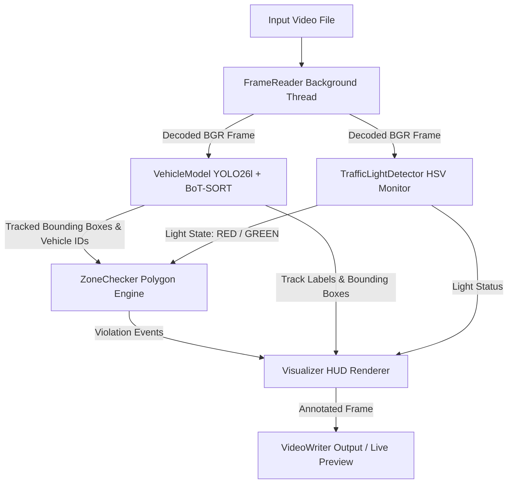

# Vehicle Detection, Tracking, and Traffic Violation Module

An end-to-end, high-performance Computer Vision system designed for real-time vehicle detection, multi-object tracking, traffic light state classification, and automated red-light violation detection in complex traffic video feeds.

Powered by **Ultralytics YOLO26l** and **BoT-SORT**, this module is optimized for high accuracy on challenging road scenarios (such as small/distant motorcycles) and high throughput via FP16 tensor acceleration and multi-threaded CPU frame pre-fetching.

---

## 🌟 Key Features

- 🏎️ **Multi-Class Vehicle Detection & Tracking**: Detects and tracks 5 distinct vehicle categories (**Bicycle, Car, Motorcycle, Bus, Truck**) simultaneously using COCO-trained YOLO26l weights and persistent BoT-SORT state tracking.
- 🔴 **Automated Traffic Light Detection**: Real-time traffic signal classification using HSV color space brightness sampling with 3-frame majority voting for temporal stability.
- 🚨 **Red-Light Violation Detection**: Spatial polygon tracking that continuously tracks vehicle bottom-center coordinates from designated approach lanes into intersection regions during red light signals.
- ⚡ **Optimized Video Pipeline**: Asynchronous multi-threaded `FrameReader` decouple CPU video decoding from GPU tensor execution, eliminating GPU idle gaps.
- 🛠️ **Interactive Zone Drawing GUI**: Built-in OpenCV GUI (`ZoneDrawer`) to interactively map lane boundaries, intersection polygons, and traffic light coordinates directly on video frames.
- 📊 **Headless & Cloud-Ready**: Configurable for headless Linux GPU instances (e.g. AWS, ThunderCompute) with output video saving, or local live visual preview HUD.

---

## 📁 Repository Structure & Modules

The repository is modularly organized into targeted Python modules:

```text
VehicleDetectionAndTrackingModule/
├── config.py                  # Global project configuration settings
├── main.py                    # Pipeline orchestrator and FrameReader thread loop
├── vehicle_model.py           # Unified YOLO26l detector and BoT-SORT tracker wrapper
├── traffic_light_detector.py  # HSV-based traffic light state monitor
├── zone_checker.py            # Point-in-polygon vehicle trajectory & violation logic
├── zone_drawer.py             # Interactive OpenCV zone mapping utility
├── visualizer.py              # Frame HUD renderer, annotations, & statistics overlay
├── setup_cloud.sh             # One-click environment installer for cloud instances
├── requirements.txt           # Python dependency requirements
├── zones.json                 # Polygon coordinates for lanes, intersections, & lights
├── test_1.mp4                 # Sample input traffic video 1
└── test_2.mp4                 # Sample input traffic video 2
```

### Module Descriptions

- **[config.py](file:///home/trung/Projects/VehicleDetectionAndTrackingModule/config.py)**: Central configuration containing model checkpoints (`yolo26l.pt`), confidence thresholds (`0.30`), resolution (`1280px`), class ID mappings, tracking parameters, and execution toggles (`SHOW_LIVE_PREVIEW`, `ENABLE_ZONE_DRAWER`).
- **[main.py](file:///home/trung/Projects/VehicleDetectionAndTrackingModule/main.py)**: Main entry point. Implements an asynchronous `FrameReader` thread queue to pre-decode frames ahead of GPU execution, coordinates detection, light monitoring, violation checks, and video output writing.
- **[vehicle_model.py](file:///home/trung/Projects/VehicleDetectionAndTrackingModule/vehicle_model.py)**: Encapsulates `ultralytics.YOLO` inference with built-in BoT-SORT tracking (`botsort.yaml`) operating in FP16 precision. Filters detection tensors to configured target classes and tracks total unique vehicle counts.
- **[traffic_light_detector.py](file:///home/trung/Projects/VehicleDetectionAndTrackingModule/traffic_light_detector.py)**: Monitors user-defined pixel regions for red/green light signals. Converts frame regions to HSV color space, calculates color saturation/value density, and applies majority-voting smoothing across frames.
- **[zone_checker.py](file:///home/trung/Projects/VehicleDetectionAndTrackingModule/zone_checker.py)**: Performs OpenCV ray-casting polygon tests (`cv2.pointPolygonTest`) using the bottom-center of vehicle bounding boxes. Registers lane presence and triggers red-light violations when vehicles cross into the intersection zone during a red light.
- **[zone_drawer.py](file:///home/trung/Projects/VehicleDetectionAndTrackingModule/zone_drawer.py)**: Interactive GUI utility allowing users to click and define custom lane polygons, intersection boundaries, and traffic light monitor locations on the first frame of a video.
- **[visualizer.py](file:///home/trung/Projects/VehicleDetectionAndTrackingModule/visualizer.py)**: Draws color-coded bounding boxes, vehicle ID labels (`#ID class`), status overlay panels (vehicle count, total tracked, violation count, current light state), and polygon zone outlines.
- **[setup_cloud.sh](file:///home/trung/Projects/VehicleDetectionAndTrackingModule/setup_cloud.sh)**: Automated shell setup script for installing OS graphics libraries (`libgl1`, `ffmpeg`), Python dependencies, and pre-fetching model weights.

---

## ⚙️ Architecture & Pipeline Flow



---

## 🛠️ Installation & Setup

### Prerequisites
- Linux OS (Ubuntu 20.04+ recommended)
- Python 3.9+
- NVIDIA GPU with CUDA support (for accelerated inference)

### Quick Setup (Local or Cloud Instance)

1. **Clone the Repository**:
   ```bash
   git clone https://github.com/trungngothanh13/VehicleDetectionAndTrackingModule.git
   cd VehicleDetectionAndTrackingModule
   ```

2. **Automated Setup (Cloud GPU / Linux)**:
   Run the provided setup script to install system packages, Python dependencies, and download YOLO26 weights:
   ```bash
   bash setup_cloud.sh
   ```

3. **Manual Setup**:
   ```bash
   # System packages
   sudo apt-get update && sudo apt-get install -y ffmpeg libgl1

   # Python dependencies
   pip install -r requirements.txt

   # Pre-download YOLO weights
   python -c "from ultralytics import YOLO; YOLO('yolo26l.pt')"
   ```

---

## 🚀 Usage Guide

### 1. Running Vehicle Tracking & Violation Detection

To run the complete processing pipeline on the configured video:
```bash
python main.py
```
By default, the script processes `test_2.mp4` and outputs `output_test_2.mp4` with full overlay analytics.

### 2. Configuring Zone Polygons (`ZoneDrawer`)

To draw or adjust lane polygons, intersection zones, and traffic light coordinates:

1. Edit [config.py](file:///home/trung/Projects/VehicleDetectionAndTrackingModule/config.py) and set:
   ```python
   ENABLE_ZONE_DRAWER = True
   ```
2. Launch the drawer interface:
   ```bash
   python main.py
   ```
3. Use the following keyboard controls in the window:
   - `1`: Start drawing **Lane** polygon (Click points on frame)
   - `2`: Start drawing **Intersection** polygon (Click points on frame)
   - `3`: Click to set **Green Light** coordinate
   - `4`: Click to set **Red Light** coordinate
   - `c`: Complete current polygon
   - `s`: Save all zones to [zones.json](file:///home/trung/Projects/VehicleDetectionAndTrackingModule/zones.json)
   - `r`: Reset active points
   - `d`: Delete last added zone/light
   - `ESC`: Exit drawer

4. Set `ENABLE_ZONE_DRAWER = False` in [config.py](file:///home/trung/Projects/VehicleDetectionAndTrackingModule/config.py) to resume standard detection processing.

---

## 🔧 Configuration Reference ([config.py](file:///home/trung/Projects/VehicleDetectionAndTrackingModule/config.py))

| Parameter | Type | Default Value | Description |
| :--- | :--- | :--- | :--- |
| `MODEL_NAME` | `str` | `'yolo26l.pt'` | Ultralytics model weights |
| `CONFIDENCE_THRESHOLD` | `float` | `0.30` | Detection confidence threshold |
| `IMGSZ` | `int` | `1280` | Input resolution (1280px for high-detail motorcycle detection) |
| `DETECTION_CLASSES` | `dict` | `{1:'bicycle', 2:'car', 3:'motorcycle', 5:'bus', 7:'truck'}` | Target COCO vehicle class mappings |
| `INPUT_VIDEO` | `str` | `'test_2.mp4'` | Input video file path |
| `OUTPUT_VIDEO` | `str` | `'output_test_2.mp4'` | Rendered video output file path |
| `SHOW_LIVE_PREVIEW` | `bool` | `False` | Show interactive OpenCV window (`False` for headless servers) |
| `SAVE_OUTPUT_VIDEO` | `bool` | `True` | Write annotated video to disk |
| `TRACKER_TYPE` | `str` | `'botsort.yaml'` | Tracker config (`'botsort.yaml'` or `'bytetrack.yaml'`) |
| `TRACK_BUFFER` | `int` | `60` | Frame buffer (~2s at 30fps) for handling occluded tracking recovery |
| `TRACKER_DEVICE` | `str` | `'cuda'` | Computation device (`'cuda'` or `'cpu'`) |
| `ZONES_FILE` | `str` | `'zones.json'` | JSON path storing zone polygons and light points |

---

## 📄 Zone Data Specification (`zones.json`)

Zone polygons and traffic light coordinates are stored in standard JSON format:

```json
{
  "lanes": [
    [[385, 165], [528, 479], [849, 477], [850, 317], [616, 158]]
  ],
  "intersection": [
    [385, 164], [615, 156], [514, 88], [387, 89], [367, 123]
  ],
  "traffic_lights": [
    { "x": 547, "y": 15, "color": "green" },
    { "x": 533, "y": 15, "color": "red" }
  ]
}
```

---

## 📈 Performance Optimizations

1. **FP16 Half-Precision Execution**: `VehicleModel` passes `quantize='fp16'` to Ultralytics inference, significantly increasing CUDA tensor core throughput.
2. **High Resolution (1280px)**: Enables accurate bounding box proposal and tracking continuity for small distant vehicles and dense motorcycle traffic.
3. **Decoupled Asynchronous IO**: `FrameReader` operates on a background daemon thread with an 8-frame buffer queue, ensuring OpenCV video decoding never blocks GPU inference.